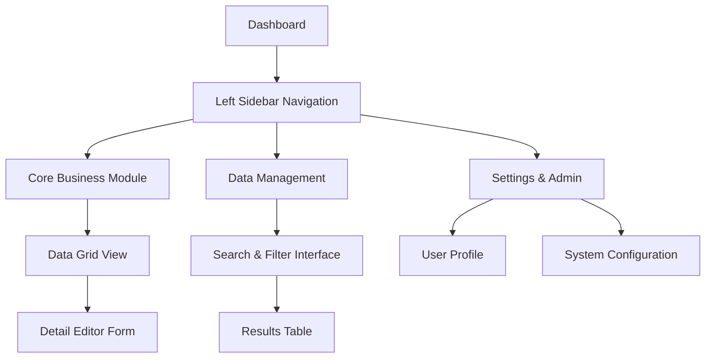
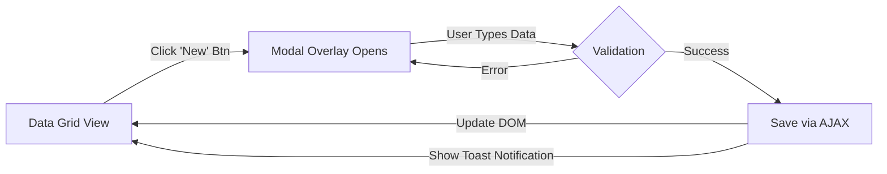

# {{Project Name}} UI/UX Specification

## 1. Introduction

This document defines the user experience goals, information architecture, user flows, and visual design specifications for **{{Project Name}}**. Given the technical constraints of a **Pure HTML/CSS/JavaScript** stack and a **Desktop-Only** target, this specification prioritizes lightweight, standards-compliant design patterns that ensure high performance and maintainability without external framework dependencies. 

### 1.1 Overall UX Goals & Principles

* **Target User Personas**:
* 
**Primary User**: Data Analyst / Operator - Needs high information density, rapid data entry, and keyboard efficiency. 

* **Secondary User**: Manager / Viewer - Needs clear dashboards and reporting summaries.

* **Usability Goals**:
* 
**High-Efficiency Interaction**: Capitalize on the desktop environment (keyboard shortcuts, right-click menus). 

* **Instant Feedback**: UI response times under 100ms using lightweight vanilla JS.
* **Keyboard Accessibility**: 100% of core tasks accessible via Tab/Enter/Arrows.

* **Design Principles**:
* 
**Native Elegance**: Utilize modern CSS (Flexbox/Grid/Variables) over JS animations. 

* **Density Comfortable**: distinct information hierarchy without excessive scrolling.
* **Modular & Reusable**: Strict "Utility Class" system (e.g., `.btn-primary`) to prevent style drift.

---

2. Information Architecture (IA) 

### 2.1 Site Map

*(Optimized for Widescreen Desktop Viewports)*

### 2.2 Navigation Structure

* **Primary Navigation (Sidebar)**: Fixed left vertical sidebar. Collapsible via toggle button (`.nav-toggle`). Uses CSS transitions for smooth width changes. 

* **Breadcrumbs**: Located top-left (`Home > Module > Section`). Essential for deep navigation.
* **Global Actions**: Top-right header area for "User Profile", "Notifications", and "Global Search".

---

3. User Flows 

### 3.1 Flow: Create & Edit Record (CRUD)

**User Goal**: Efficiently add new data entry without leaving the context.

* **Key Interaction**: The Modal (`.modal`) should trap focus (keyboard focus constrained inside modal) until closed.

---

4. Component Library / Design System 

Since we use **Pure HTML/CSS**, consistency relies on a strict CSS Class naming convention (BEM-lite methodology recommended).

### 4.1 Grid & Layout System

* **Container**: `.container-fluid` (100% width with 24px padding) for maximum data visibility.
* **Grid**: Native CSS Grid for page layouts (`display: grid`), Flexbox for components (`display: flex`).
* **Panels**: `.card` class for grouping content (White background, light border, minimal shadow).

### 4.2 Core Components

#### A. Buttons (`.btn`)

* **Primary**: `.btn .btn-primary` (Brand Color background, White text). For main actions (Save, Submit).
* **Secondary**: `.btn .btn-secondary` (Grey background, Dark text). For Cancel, Back.
* **Destructive**: `.btn .btn-danger` (Red text/border). For Delete actions.
* **States**: Must define `:hover`, `:active`, `:focus`, and `:disabled`.

#### B. Forms (`.form-group`)

* **Input**: `.form-input`. 1px solid border `#E0E0E0`, 4px radius. `:focus` state adds Brand Color border and ring shadow.
* **Label**: Top-aligned text, bold weight, 12px size.
* **Validation**:
* Error state: Input border becomes Red.
* Message: `.form-error-msg` appears below input in Red.

#### C. Data Tables (`.data-table`)

* **Structure**: Semantic `<table>`, `<thead>`, `<tbody>`.
* **Styling**:
* Striped rows (`.table-striped`) for readability on long lists.
* Sticky Header (`position: sticky; top: 0`) for scrolling long datasets.
* Row Hover (`tr:hover`): Light grey background highlight.

* **Actions**: Right-aligned column for "Edit/Delete" icon buttons.

#### D. Modals (`.modal`)

* **Overlay**: Fixed position backdrop (`rgba(0,0,0,0.5)`).
* **Dialog**: Centered box. Max-width 600px (standard) or 900px (large).
* **Behavior**: Clicking overlay or pressing `Esc` closes modal via JS event listener.

---

5. Branding & Visual Style 

### 5.1 Color Palette

* 
**Primary (Brand)**: `#0066CC` (Deep Blue) - Professional, trust-building. 

* **Secondary**: `#475569` (Slate Grey) - For UI structural elements.
* **Backgrounds**:
* App BG: `#F8FAFC` (Light Grey Blue) - Reduces eye strain.
* Content BG: `#FFFFFF` (White).

* **Status Colors**:
* Success: `#10B981` (Green)
* Warning: `#F59E0B` (Amber)
* Error: `#EF4444` (Red)

5.2 Typography 

* **Font Family**: System UI Stack (`-apple-system, BlinkMacSystemFont, "Segoe UI", Roboto, Helvetica, Arial, sans-serif`).
* 
*Rationale*: Zero load time, perfect OS integration, best legibility on desktop monitors. 

* **Type Scale**:
* H1 (Page Title): 24px / Bold
* H2 (Section Title): 20px / Semi-Bold
* Body: 14px / Regular (Optimized for data density)
* Small/Caption: 12px / Grey

---

6. Accessibility Requirements 

### 6.1 Keyboard Navigation

* **Focus Indicators**: All interactive elements (`a`, `button`, `input`) must have a visible outline on `:focus`. **DO NOT remove `outline` via CSS unless replaced with a custom style.**
* **Tab Index**: Logical tab order (Left-to-Right, Top-to-Bottom).
* **Skip Links**: Include a "Skip to Main Content" link hidden at the top for keyboard users.

### 6.2 Visual Accessibility

* **Contrast**: Text color must meet WCAG AA standard (4.5:1 ratio) against background.
* **Scaling**: Layout allows browser zooming up to 200% without breaking.

---

7. Responsiveness Strategy (Desktop Only) 

Since we target **Desktop Browsers Only**, we do not need complex media queries for mobile.

* **Minimum Width**: Layout guaranteed to work down to **1024px** width.
* *Below 1024px*: Horizontal scrollbar is acceptable (or minimal adaptation).

* **Fluid Layout**:
* Sidebar: Fixed width (e.g., 250px).
* Main Content: `flex: 1` or `width: calc(100% - 250px)`.

* **Large Screens (>1920px)**: Content wrapper max-width can be set to 1600px/1920px centered, OR full-width fluid depending on data density needs.

---

8. Animation & Micro-interactions 

* **Principles**: "Fast & Functional". Max duration **200ms**.
* **Key Animations**:
* **Button Hover**: Slight background darken/lighten (`transition: background-color 0.2s ease`).
* **Modal Open**: Fade in + slight slide down (`opacity: 0` -> `1`, `transform: translateY(-20px)` -> `0`).
* **Toast Notification**: Slide in from top-right.

---

9. Performance Considerations 

* **Asset Loading**: Use SVG icons (inline or sprite) instead of icon fonts to reduce requests.
* **DOM Manipulation**: Use `document.createDocumentFragment()` for batch inserting table rows to minimize reflows.
* **CSS Architecture**: Place all critical CSS in `<head>`. Avoid `@import` in CSS files.

---

10. Next Steps 

1. **HTML Prototyping**: Create a static HTML/CSS template for the "Dashboard" and "Data Grid" layout based on these specs.
2. **Style Guide Implementation**: Create a `style.css` file defining the CSS variables (Colors, Fonts) and Utility Classes.
3. **Handoff**: Provide this document + HTML prototype to the Development Agent.